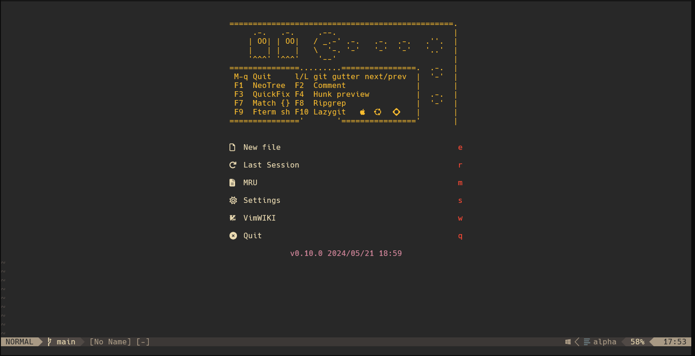

*packer*

linux
```
git clone --depth 1 https://github.com/wbthomason/packer.nvim ~/.local/share/nvim/site/pack/packer/start/packer.nvim
```

window powershell
```
git clone https://github.com/wbthomason/packer.nvim "$env:LOCALAPPDATA\nvim-data\site\pack\packer\start\packer.nvim"
```

*plug*

window powershell
```
iwr -useb https://raw.githubusercontent.com/junegunn/vim-plug/master/plug.vim |` ni "$(@($env:XDG_DATA_HOME, $env:LOCALAPPDATA)[$null -eq $env:XDG_DATA_HOME])/nvim-data/site/autoload/plug.vim" -Force
```

linux
```
sh -c 'curl -fLo "${XDG_DATA_HOME:-$HOME/.local/share}"/nvim/site/autoload/plug.vim --create-dirs \
       https://raw.githubusercontent.com/junegunn/vim-plug/master/plug.vim'
```
